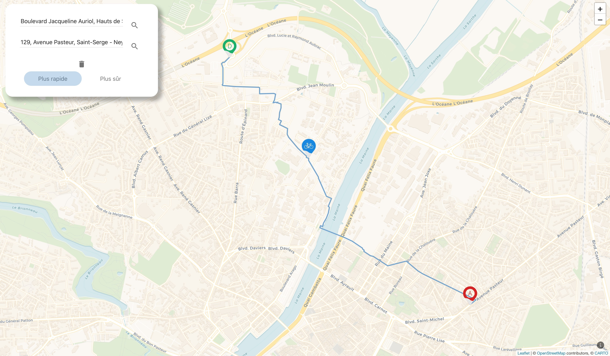

# PFE Ember ORS


[](https://github.com/RemyCo/pfeEmberORS/releases)
[](https://github.com/RemyCo/pfeEmberORS/releases)
[](https://github.com/RemyCo/pfeEmberORS/commits/master)
[](https://github.com/RemyCo/pfeEmberORS/graphs/contributors)
[](https://github.com/RemyCo/pfeEmberORS/blob/master/LICENSE)



This project, in charge for the city of Angers in France, was made for a PFE, a graduation project. It is a cyclist route calculator, to be put in the app of the city of Angers later. The server side use ORS, and the client side use Ember and Leaflet to properly make the route calculator.

## Prerequisites

You will need the following things properly installed on your computer.

* [Git](https://git-scm.com/)
* [Node.js](https://nodejs.org/) (with npm)
* [Ember CLI](https://ember-cli.com/)

## Installation

```bash
# Clone this repository
$ git clone https://github.com/RemyCo/pfeEmberORS.git

# Go into the repository
$ cd path-editor

# Install dependencies
$ npm install

# Run the app
$ ember s
```

## Running / Development

* `ember serve`
* Visit your app at [http://localhost:4200](http://localhost:4200).
* Visit your tests at [http://localhost:4200/tests](http://localhost:4200/tests).

### Running Tests

* `ember test`
* `ember test --server`


## Further Documentation

|  Documentation  |  Installation Guide  |
|  ---  |  ---  |
|  [Wiki](https://github.com/RemyCo/pfeEmberORS/wiki)  |  [Installation Guide](https://github.com/RemyCo/pfeEmberORS/wiki/Installation-POC-sur-ordinateur)  |


## Credits

* [Ember.js](https://emberjs.com/)
* [Ember-CLI](https://ember-cli.com/)
* [OpenStreetMap](https://www.openstreetmap.org)
* [Another Example](https://gitlab.ippon.fr/bpinel/PathEditor)
